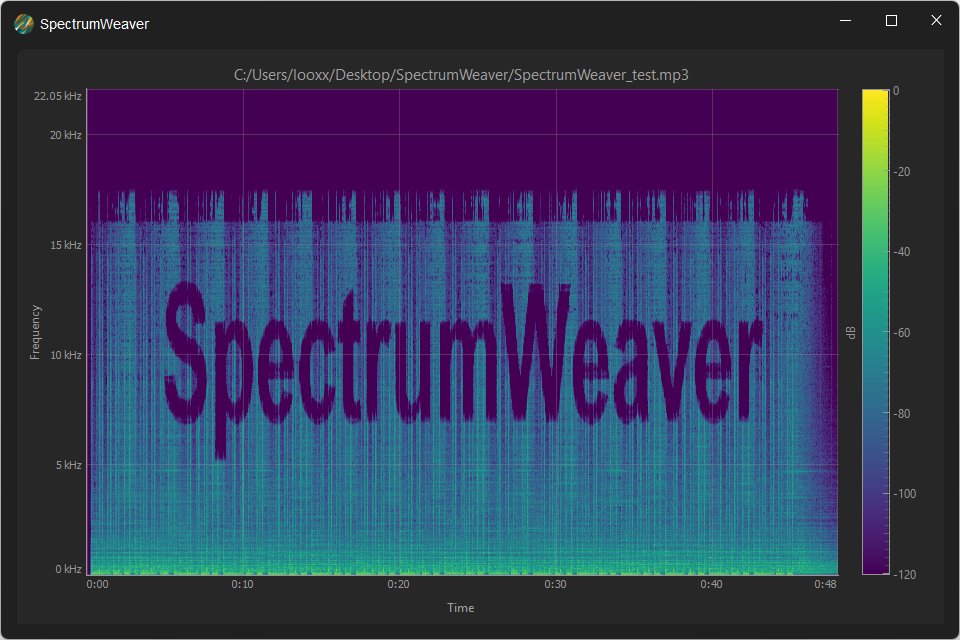

# SpectrumWeaver

Real-time acoustic spectrum analyzer built with Python and Qt. Streams audio files in chunks, computes an FFT spectrogram, and renders it progressively with PyQtGraph.



## Features

- Streaming analysis of large audio files with bounded memory usage
- Interactive spectrogram (zoom/pan) with custom time/frequency axes
- Formats: WAV, FLAC, OGG (built-in, via libsndfile) and MP3, M4A, AAC (via the bundled FFmpeg binary)
- Drag & drop file loading
- Batch size and colormap settings via the context menu
- PNG export of the spectrogram

## Requirements

- Python 3.13+
- Windows, macOS, or Linux
- [uv](https://docs.astral.sh/uv/) (recommended) or pip

## Installation

```bash
git clone <repository-url>
cd SpectrumWeaver
uv sync
```

## Running

```bash
uv run python src/spectrum_weaver.py
```

Drag an audio file onto the window to analyze it.

## Project structure

```
SpectrumWeaver/
├── src/
│   ├── spectrum_weaver.py            # Entry point
│   ├── analyzers/
│   │   ├── audio_io.py               # Decoding: soundfile (lossless) + FFmpeg fallback (lossy)
│   │   └── spectrum_analyzer.py      # Streaming chunked FFT
│   ├── gui/
│   │   ├── spectrum_viewer.py        # Spectrogram widget (batched, throttled updates)
│   │   ├── custom_title_bar.py
│   │   ├── custom_context_menu.py    # Export / details / settings
│   │   └── custom_axes_items.py      # Time/frequency axis labels
│   └── assets/
│       ├── icon.png
│       └── styles.qss
├── tests/
├── tools/spectrum_weaver.spec        # PyInstaller spec
├── pyproject.toml
└── uv.lock
```

## Building the executable

From the project root:

```bash
uv sync --group dev
uv run pyinstaller tools/spectrum_weaver.spec
```

The one-file executable is written to `dist/spectrum_weaver(.exe)`. The FFmpeg binary
(needed for MP3/M4A/AAC) is bundled automatically via `imageio-ffmpeg`. UPX is disabled
for faster startup (unpacking a compressed payload costs more than the saved space).

## Design notes

- Audio is decoded at the native sample rate in fixed-size chunks (`audio_io.py`).
- Frames are produced with a zero-copy sliding window and processed in batches of
  `fft_size` (2048, Hann window) with `numpy.fft.rfft`.
- Linear FFT bins are averaged into ~160 log-spaced frequency bands, cutting memory
  and rendering cost ~4x for long files.
- The viewer writes batch results into a preallocated array and repaints at most
  ~30 times per second, so UI cost is independent of the number of frames.
